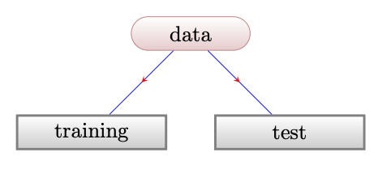
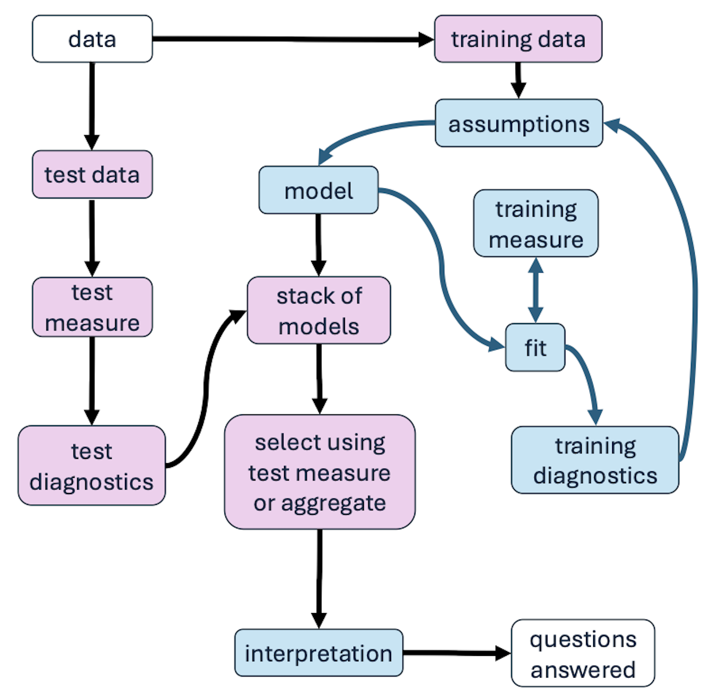
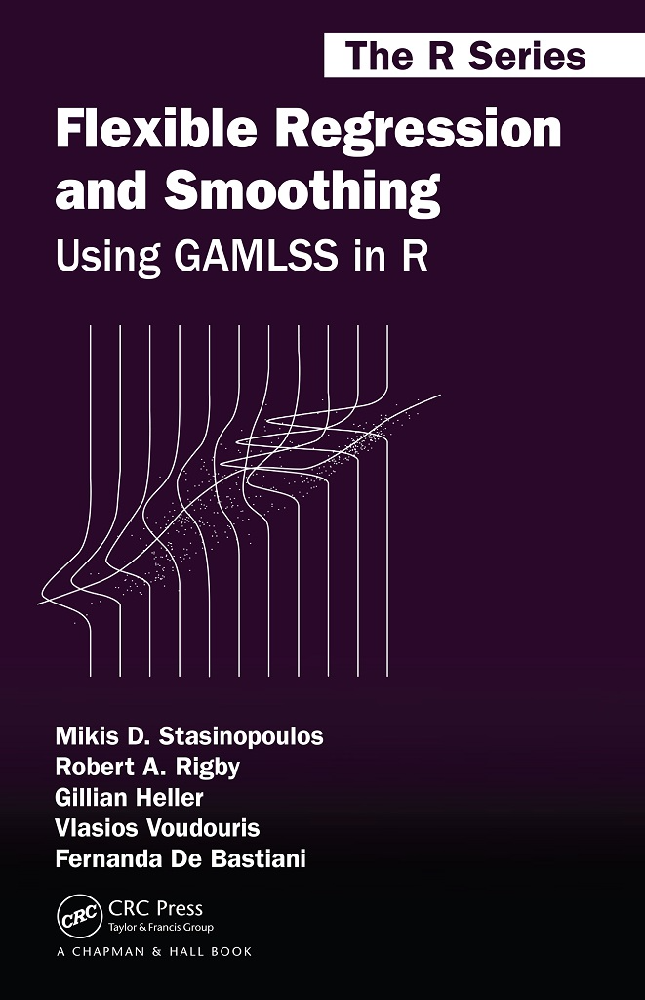

## introduction

- in the 70's @BOxJenkins70 had a diagram to show what is `statistical modelling` (SM)

- over the last 40 years I have not seen something similar  

- discuss basic ideas of `statistical modelling`

- using a `distributional regression` example

```{r}
 library("DiagrammeR")
#  mermaid("
#  graph LR
#    Q(question) --> D(data)
#      D --> M(model)
#      M --> A[answer] 
#      A --> Q
# style Q fill:#dff
#     style M fill:#fdd
#     style D fill:#dfd")
```

## why SM? {.smaller}

{width="90%" height="400px"}

- The `data`, are collected to answer the `question` and this is done through a `model`.

- The concepts are `interconnected`

## Model

- 

  > `all models are wrong but some are useful`.
  >
  > -- George @box1979robustness

- whether a model is useful depends on the `purpose` of the study.

- A `model` is useful if it can  answer the `question`

## Regression Models


@breiman2003statistical

- 
  $$X  {\longrightarrow}  \fbox{NATURE} {\longrightarrow} Y, $$

- 
  $$X  {\longrightarrow}  \fbox{Model} {\longrightarrow} Y, $$

-
  $$X  {\longrightarrow} \fbox{G(X)}  {\longrightarrow} Y.$$

- the `model` tries to unmask the unknown function $G()$ which could be `mathematical` or `algorithmic`

## Statistical model  {.smaller}

- `deterministic model`: $Y =G(X)$

- `statistical model`: $Y =G(X, E)$, where $E$ is the error (a probabilistic component)

- $G(X, E)$ represent both the $\textit{signal}$ and $\textit{noise}$ in the `data`

- An additive model `assumption`: $$Y =G(X)+E$$ is a common model assumption for the $\textit{signal}$ and the $\textit{noise}$, widely used in `machine learning` with implicit normal errors.

## Assumptions

- an `assumption` is an axiomatic statement which need to be approximately correct for the model work.

- if `all` the assumptions are approximately correct then the model could be useful

- the `assumptions` often help with the `intepretation` of a model

## Assumptions (2) {.mediun}

- `explicit` assumptions, are easier to check;

- `implicit` assumptions, are often not checked;

- `incorrect` assumptions could lead to questionable scientific discoveries;

- `assumptions` should be checked using `diagnostic` tools;

## Algorithmic \<-\> Stastistical  models {.mediun}

- `statistical models,` the function $G(X,E)$ is defined explicitly through the `assumptions`

- `algorithmic models` make implicit assumptions about the function $G(X,E)$.

- the additive algorithmic `model` $G(X)+E$ makes implicit assumptions for $G(X)$ and the `natural error`

## Distributional regression models

 {width="90%" height="100px"}

The `parametric` Distributional Regression model [@RigbyStasinopoulos05, @stasinopoulos2024generalized] can be represented as

$$X  {\longrightarrow}  \fbox{$\boldsymbol{\theta}$(X)} {\longrightarrow} D(Y|\boldsymbol{\theta}(X)),$$
where $D(Y|\boldsymbol{\theta}(X))$ estimates the `natural error` distribution of $Y$ (conditional on the $X$).

## Distributional regression models

- The task of parametric `distributional Regression` is to find ;

  - `which` and `how` the x's effect the parameters of the distribution i.e $\boldsymbol{\theta}(X)$ and
  - the appropriate `distribution` for the response i.e. $D(Y|\boldsymbol{\theta})$

## Distributional regression models

- A `modern` computational approach of the distributional regression, @chai2026neural; $$X, U  {\longrightarrow}  \fbox{deep learning} {\longrightarrow} D(Y|X),$$
  where U represent a simple distribution e.g. uniform which after transformations becomes $D(Y|X)$ the conditional distribution of $Y$ given $X$.

This version of the DR model is NOT easy to interpret because it is a `black box`.

## The Albumin (ALB): (`data`)

```{r}
#| warning: false 
#| echo: false
library(gamlss.prepdata) 
library(ggplot2) 
rm(list=ls())
load(file="/Users/dimitriosstasinopoulos/Dropbox/github/gamlss.data/data/ALB.rda")
```

```{r}
library(gamlss2)
plot(ALB~ga, data=ALB, xlab="gestational age")
```

```{r}
#| cache: true
#| echo: false
#| include: false
#| label: "smooth function"
m2 <- gamlss(ALB ~ pb(ga),
             sigma.formula = ~ pb(ga),
             nu.formula = ~ pb(ga),  
             tau.formula = ~ pb(ga),
             family = BCTo, data = ALB) 
```

## The Albumin (ALB) (`model`)

```{r}
#| label: fig-a
#| echo: false
library(gamlss.ggplots)
fitted_centiles_gap(m2, cent=c(97.5, 90, 75, 50, 25, 2.5), title="(a)",  data=FALSE )+
  xlab("gestational age")+
  ggplot2::theme_bw(15)
```

## The Albumin (ALB) (`question`)

```{r}
#| label: fig-c
#| echo: false
#| 
ALBe <- data.frame(ALB, zscores=resid(m2), index=resid(m2) < qnorm(.05))
 ggplot(ALBe, aes(y=zscores, x=ga, colour=index))+
          geom_point()+
  xlab("gestational age")+
   ggtitle("(c)")+
   geom_hline(yintercept = qnorm(.95))+
   geom_hline(yintercept = qnorm(.05))+
   ggplot2::theme_bw(15)
```

## Fit

- ways  to `fit` a model

1)  maximize/minimize an objective measure of `goodness of fit`, $\mathbb{R}(Y,G(X,E))$, (i.e. a `training measure`) to obtain the fitted values: $$\widehat{D} = \widehat{G} (X,E)$$

2)  simulate from the model $G(X,E)$ and then average to obtain the fitted values $\widehat{Y}$ or a fitted distribution $\widehat{D}$

## residuals 

- `training residuals`: $$\widehat{r}=r(Y, \widehat{D})$$ for a suitable function $r$.

- if the model is `adequate` the `training residuals` should look as a `white noise`

- `white noise`, zero mean, constant variance and independent observations

- `residuals` can be used as a `diagnostic` tool

## Diagnostics {.smaller}

1)  `training residuals diagnostics`:

- `are the residuals white noise`?

  - yes: `adequate model` the model is not under-fitting the data

  - no: start again 

- residuals can be calculated  for all `statistical models`, so residual diagnostics is an `agnostic` tool.

2)  Other types of `diagnostics` could check other assumptions or possibly `focus` in answering the `question`.

## Classical statistical modelling

{width="90%" height="550px"}

## Classical statistical modelling 1

{width="90%" height="550px"}

## Classical statistical modelling: comments

- the classical statistical modelling approach can find an `adequate` model

- but can not check for `over-fitting`

- we `overfit` if the `model` is close to the `data` but it does not generalised on `new data`

- `data partition` can help with this

## Data Partition

{width="90%" height="300px"}

data partition helps to check `over-fitting` and to improve `inference`

## types of Partition

i)  `single` partition (holdout samples)

ii) `multiple` partitions (bootstrapping, K-fold cross validation )

importantly the `data` are divided to

- `training` `data`

- `test` `data`

<!-- ## data partition 2 -->

<!-- {width="100"} -->

## stack of models

- for each `data` set there could be several models which are not under-fitting or over-fitting the data called the `Rashomon set`

- several models from the `Rashomon set` are `interpretable` @rudin2024amazing.

- how to chose between different adequate models?

  1) use a `test measure` of goodness of fit or even better use a `focus test measure` of goodness of fit
  2) or use `model average`

## model average

- for DR we can average their fitted distributions @rugamer2024mixture

 $$ Av({\hat{f{}}_{2}})=\pi_1 {\hat{f{}}_{1}}(Y)+\pi_2 {\hat{f{}}_{2}}(Y)+\ldots, \pi_k {\hat{f{}}_{k}}(Y)$$

- or make the mixing probabilities functions of the covariates;

$$ Av(\hat{f{}})=\pi_1(X) \hat{f{}}_{1}(y)+\pi_2(X) \hat{f{}}_{2}(y)+\ldots, \pi_k(X) \hat{f{}}_{k}(y)$$

## Model comparison

- use a `test measure` of goodness of fit

- for the ALB data sets we use

  - deviance ($-2 \ell$) as global `test measure`
  - $\chi^2$ values as `focused test measure`

Both applied to the ALB data and lead to the `BCTo` distribution as the best distribution.

## ALB diagnostics

```{r}
#| label: fig-b
resid_wp(m2, title="(b)")+
  ggplot2::theme_bw(15)
```

## ALB diagnostics 2

```{r}
#| label: fig-b-wrap
resid_wp_wrap(m2, xvar=ALB$ga)
```

## Modern Statistical Modelling

{width="90%" height="570px"}

## Discussion {.smaller}

- most problems in SM arise if the `assumptions` are not correct 

- `measures of goodness of fit` are needed for both model `fitting` and model `comparison` 

- the two  `measures of goodness of fit` can be different  

- ideally  `measures of goodness of fit` should `focus` on the `question`

- the  `measure` of goodness of fit can be model `agnostic`

- `diagnostics` evaluated at `test` and `training` `data` should be part of any SM

- `interpretable` (mostly mathematical)  models easier to check.

- "Stop explaining black box machine learning models for `high stakes decisions` and use `interpretable` models instead" [@rudin2019stop]

## end

::: {layout-ncol="3," layout-nrow="1"}
{width="300"} {width="323"} {width="333"} see also the `R` package `gamlss2`
:::

## Reference {.smaller}
